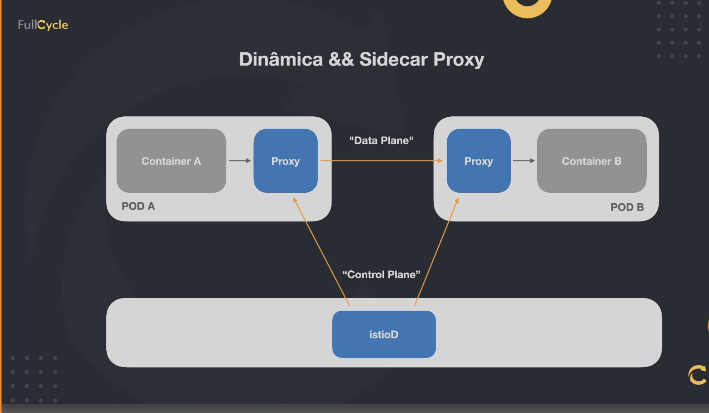

# Service mesh
Service mesh é uma camada extra adicionada junto ao seu cluster visando monitorar e modicar em tempo real o trafego das aplicacoes, bem como elevar o nivel de segurança e confiabilidade de todo ecossistema.

Istio é uma projeto open-source que implementa service mesh visando diminuir a complexidade no gerenciamento de aplicaçoes distribuidas independente de qual linguagem ou tecnologia elas foram desenvolvidas.

## Principais recursos

- Gerenciamento de trafego
    - Gateways(Entrada e saida)
    - Load balancing
    - Timeout
    - Politicas de retry
    - Circuit Breaker
    - Fault injection
        - Criar erros propositais para testar reacao e recuperação
    - Observabilidade
        - Metricas
        - Traces distribuidos
        - Logs
    - Segurança
        - Man-in-the-middle
            - Criptografia entre os servicos
        - mTLS
            - Cerfificado entre a comunicacao dos servicos
        - AAA (Authentication, authorization, audit)

## Arquitetura do istio

### Sidecar proxy

Injeta um container dentro do pod da aplicacao, que vai receber as requisicao que o container do serviço deseja fazer para outro container de serviço. Sendo que quem recebera as requisicoes deste outro container tambem será o seu proxy.

### istiod

É uma camada que controla os sidecar proxys, injetando os mesmos e tendo informaçoes sobre os dados passando entre eles. 

